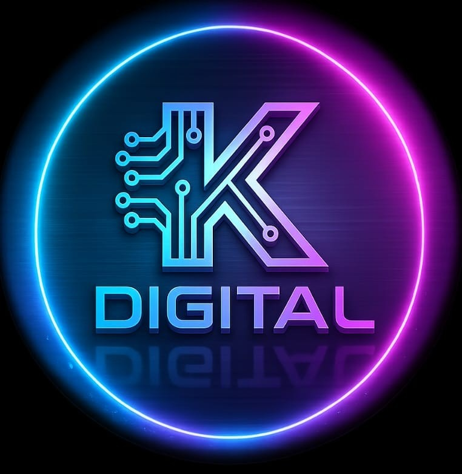

<div align="center">
  
  
  # K Digital — Performance Marketing Portfolio

  <p align="center">
    <strong>A high-converting, modern portfolio built for a digital marketing specialist.</strong>
  </p>
  
  <p align="center">
    <a href="#features">Features</a> •
    <a href="#tech-stack">Tech Stack</a> •
    <a href="#getting-started">Getting Started</a> •
    <a href="#contact">Contact</a>
  </p>
</div>

---

## 🚀 Overview

Welcome to the **K Digital Portfolio**, the professional online presence for **Koteswararao Poralla** — a Digital Marketing Specialist dedicated to generating high-quality leads and growing businesses through data-driven campaigns.

This website is designed with a **mobile-first, highly-optimized architecture** to ensure blazing-fast load times, exceptional SEO performance, and a stunning visual experience that converts visitors into leads.

## ✨ Features

- 🎨 **Modern & Vibrant UI**: Utilizes glassmorphism, fluid micro-animations, and a professional dark-navy & cyan color scheme.
- ⚡ **Lightning Fast**: Built with Vite and React for instant page loads.
- 📱 **Fully Responsive**: A flawless experience across desktops, tablets, and smartphones.
- 📈 **Performance Ready**: Preloaded assets, lazy-loaded components, and optimized imagery for top-tier Lighthouse scores.
- 📊 **Dynamic Results Display**: Interactive ROI charts and animated stat counters.
- 🧭 **Smooth Navigation**: Sticky header with smooth scrolling and a dedicated mobile menu.

## 🛠️ Tech Stack

- **Framework**: [React 18](https://reactjs.org/) + [Vite](https://vitejs.dev/)
- **Routing**: [@tanstack/react-router](https://tanstack.com/router)
- **Styling**: [Tailwind CSS](https://tailwindcss.com/)
- **Icons**: [Lucide React](https://lucide.dev/)
- **Animations**: Custom CSS animations + Framer Motion-inspired reveal hooks

## 🏃 Getting Started

To run this project locally, follow these simple steps:

### Prerequisites
Make sure you have [Node.js](https://nodejs.org/) installed on your machine.

### Installation

1. **Clone the repository:**
   ```bash
   git clone https://github.com/Porallanagaraju13/Koteswararao-Portfolio.git
   ```

2. **Navigate to the project directory:**
   ```bash
   cd Koteswararao-Portfolio
   ```

3. **Install dependencies:**
   ```bash
   npm install
   # or
   bun install
   ```

4. **Start the development server:**
   ```bash
   npm run dev
   # or
   bun run dev
   ```

5. **Open your browser:**
   Navigate to `http://localhost:5173` to see the site in action!

## 📦 Deployment

This project is optimized and ready to be deployed on **Vercel**. 
Simply connect this GitHub repository to your Vercel account, and Vercel will automatically configure the build settings for Vite (`npm run build`, output directory: `dist`).

All images in the `src/assets` folder are automatically bundled and optimized by Vite, guaranteeing they will perfectly display in the production build.

## 📬 Contact

**Koteswararao Poralla**
- **Phone / WhatsApp**: +91 9912360547
- **Email**: [porallakoteswararao91215@gmail.com](mailto:porallakoteswararao91215@gmail.com)
- **Instagram**: [@kdigital_9](https://instagram.com/kdigital_9)

---

<div align="center">
  <i>Built with ❤️ for businesses that want measurable growth.</i>
</div>
